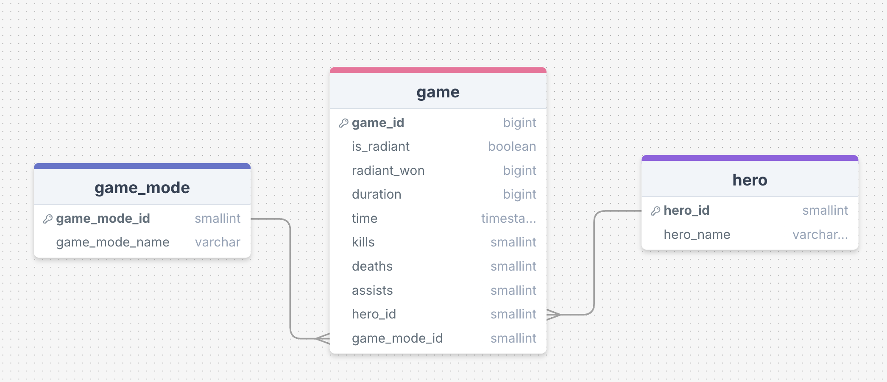

# Dashboard
This folder contains all of the fils that create and seed the database with metadata.

## Prerequisites
Make sure you have the following installed on your device:
- `python` for running the seeding script.
- `PostgreSQL` for creating the actual database.

## Setup and Installation
- By creating a virtual environment first, or otherwise, install the required python libraries by running `pip install requirements.txt`.
- Create the database by running `psql postgres -c "CREATE DATABASE dota;"`.
- Run the bash file `seed_database.sh`. You can re-run this file to reset your database whenever you want.

## Files Explained
- `schema.sql`: Creates the initial tables in the database.
- `seed_database.py`: Uploads all of the metadata for heroes and game modes to the database.
- `seed_database.sh`: A bash file that creates and seeds the database with metadata.

## Entity Relationship Diagram of the Database
